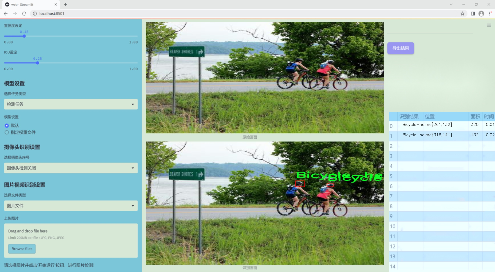
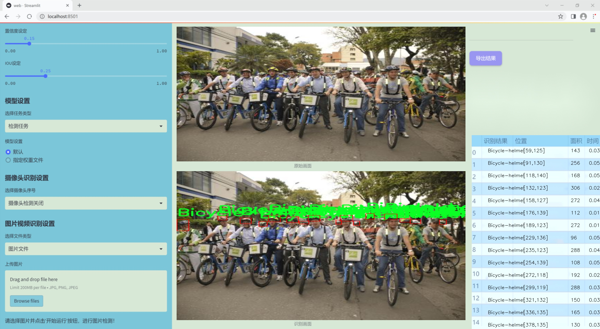
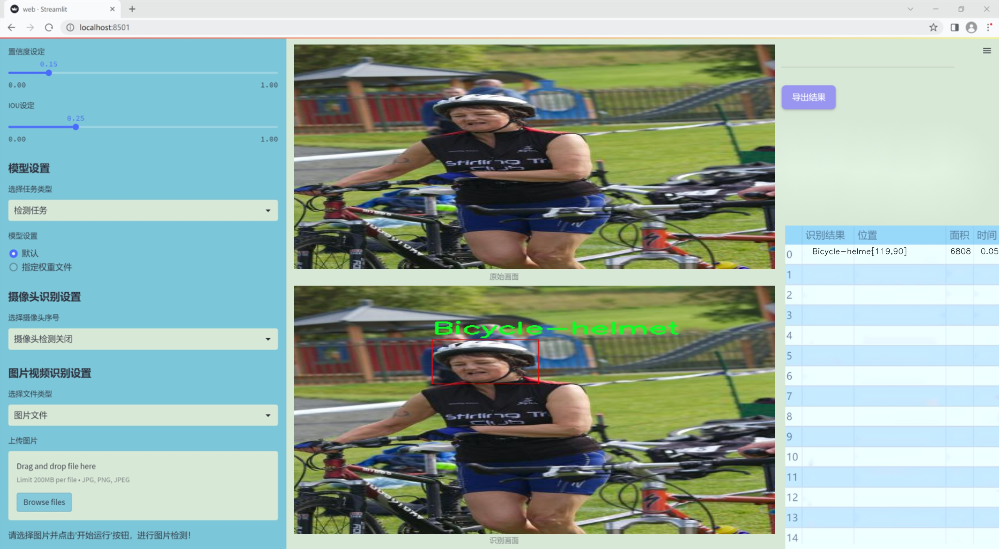
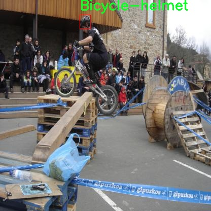
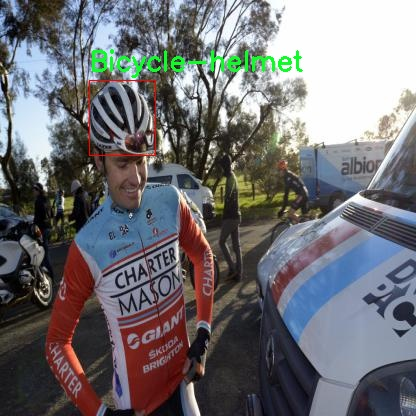
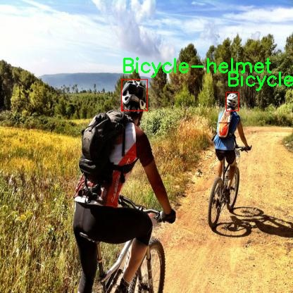
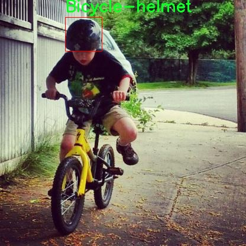

# 改进yolo11-bifpn等200+全套创新点大全：骑行头盔检测系统源码＆数据集全套

### 1.图片效果展示







##### 项目来源 **[人工智能促进会 2024.10.23](https://kdocs.cn/l/cszuIiCKVNis)**

注意：由于项目一直在更新迭代，上面“1.图片效果展示”和“2.视频效果展示”展示的系统图片或者视频可能为老版本，新版本在老版本的基础上升级如下：（实际效果以升级的新版本为准）

  （1）适配了YOLOV11的“目标检测”模型和“实例分割”模型，通过加载相应的权重（.pt）文件即可自适应加载模型。

  （2）支持“图片识别”、“视频识别”、“摄像头实时识别”三种识别模式。

  （3）支持“图片识别”、“视频识别”、“摄像头实时识别”三种识别结果保存导出，解决手动导出（容易卡顿出现爆内存）存在的问题，识别完自动保存结果并导出到tempDir中。

  （4）支持Web前端系统中的标题、背景图等自定义修改。

  另外本项目提供训练的数据集和训练教程,暂不提供权重文件（best.pt）,需要您按照教程进行训练后实现图片演示和Web前端界面演示的效果。

### 2.视频效果展示

[2.1 视频效果展示](https://www.bilibili.com/video/BV1nX1AYPEqN/)

### 3.背景

研究背景与意义

随着城市化进程的加快和骑行文化的普及，骑行安全问题日益受到关注。骑行头盔作为保护骑行者头部的重要装备，其佩戴情况直接关系到骑行者的安全。然而，许多骑行者在骑行过程中并未佩戴头盔，导致事故发生时伤害加剧。因此，开发一种高效的骑行头盔检测系统，能够实时监测骑行者的头盔佩戴情况，对于提升骑行安全具有重要意义。

在此背景下，基于改进YOLOv11的骑行头盔检测系统应运而生。YOLO（You Only Look Once）系列模型以其高效的实时目标检测能力而闻名，尤其适用于动态场景中的物体识别。通过对YOLOv11进行改进，我们可以提高其在复杂环境下的检测精度和速度，从而更好地满足骑行安全监测的需求。

本项目使用的数据集包含5000张骑行头盔的图像，专注于“Bicycle-helmet”这一类别。这一数据集的丰富性为模型的训练和测试提供了坚实的基础，使得检测系统能够在多样化的场景中表现出色。通过对这些图像进行标注和处理，改进后的YOLOv11模型将能够有效识别骑行者是否佩戴头盔，并在必要时发出警示，从而提高骑行者的安全意识。

总之，基于改进YOLOv11的骑行头盔检测系统不仅具有重要的学术研究价值，还有助于推动骑行安全技术的发展，减少交通事故的发生，保护骑行者的生命安全。随着智能交通和物联网技术的不断发展，该系统的应用前景广阔，能够为城市交通管理和骑行文化的推广提供有力支持。

### 4.数据集信息展示

##### 4.1 本项目数据集详细数据（类别数＆类别名）

nc: 1
names: ['Bicycle-helmet']


该项目为【目标检测】数据集，请在【训练教程和Web端加载模型教程（第三步）】这一步的时候按照【目标检测】部分的教程来训练

##### 4.2 本项目数据集信息介绍

本项目数据集信息介绍

本项目所使用的数据集名为“bicycle helmet”，旨在为改进YOLOv11的骑行头盔检测系统提供强有力的支持。该数据集专注于单一类别的目标检测，即“Bicycle-helmet”，因此其类别数量为1。这一专注性使得数据集在训练过程中能够更有效地聚焦于骑行头盔的特征提取与识别，提升模型在特定场景下的准确性和鲁棒性。

“bicycle helmet”数据集包含了多种不同环境和角度下的骑行头盔图像，确保了数据的多样性和代表性。这些图像涵盖了不同类型的骑行头盔，包括公路骑行头盔、山地骑行头盔等，且在光照、背景及佩戴者的服装等方面也具有一定的变化。这种多样性不仅能够帮助模型学习到骑行头盔的基本特征，还能增强其在实际应用中的适应能力，尤其是在复杂环境下的检测表现。

此外，数据集中的图像经过精心标注，确保每个骑行头盔的边界框都准确无误。这一高质量的标注为YOLOv11模型的训练提供了坚实的基础，使得模型能够在学习过程中有效地进行特征的提取与分类。通过对“Bicycle-helmet”这一类别的深入学习，模型将能够在实际应用中快速且准确地识别骑行头盔，进而提高骑行安全性。

总之，“bicycle helmet”数据集为本项目提供了丰富且高质量的训练数据，使得改进后的YOLOv11模型在骑行头盔检测任务中具备更强的性能表现，推动了智能交通安全技术的发展。










### 5.全套项目环境部署视频教程（零基础手把手教学）

[5.1 所需软件PyCharm和Anaconda安装教程（第一步）](https://www.bilibili.com/video/BV1BoC1YCEKi/?spm_id_from=333.999.0.0&vd_source=bc9aec86d164b67a7004b996143742dc)


[5.2 安装Python虚拟环境创建和依赖库安装视频教程（第二步）](https://www.bilibili.com/video/BV1ZoC1YCEBw?spm_id_from=333.788.videopod.sections&vd_source=bc9aec86d164b67a7004b996143742dc)

### 6.改进YOLOv11训练教程和Web_UI前端加载模型教程（零基础手把手教学）

[6.1 改进YOLOv11训练教程和Web_UI前端加载模型教程（第三步）](https://www.bilibili.com/video/BV1BoC1YCEhR?spm_id_from=333.788.videopod.sections&vd_source=bc9aec86d164b67a7004b996143742dc)


按照上面的训练视频教程链接加载项目提供的数据集，运行train.py即可开始训练



     Epoch   gpu_mem       box       obj       cls    labels  img_size
     1/200     20.8G   0.01576   0.01955  0.007536        22      1280: 100%|██████████| 849/849 [14:42<00:00,  1.04s/it]
               Class     Images     Labels          P          R     mAP@.5 mAP@.5:.95: 100%|██████████| 213/213 [01:14<00:00,  2.87it/s]
                 all       3395      17314      0.994      0.957      0.0957      0.0843

     Epoch   gpu_mem       box       obj       cls    labels  img_size
     2/200     20.8G   0.01578   0.01923  0.007006        22      1280: 100%|██████████| 849/849 [14:44<00:00,  1.04s/it]
               Class     Images     Labels          P          R     mAP@.5 mAP@.5:.95: 100%|██████████| 213/213 [01:12<00:00,  2.95it/s]
                 all       3395      17314      0.996      0.956      0.0957      0.0845

     Epoch   gpu_mem       box       obj       cls    labels  img_size
     3/200     20.8G   0.01561    0.0191  0.006895        27      1280: 100%|██████████| 849/849 [10:56<00:00,  1.29it/s]
               Class     Images     Labels          P          R     mAP@.5 mAP@.5:.95: 100%|███████   | 187/213 [00:52<00:00,  4.04it/s]
                 all       3395      17314      0.996      0.957      0.0957      0.0845


###### [项目数据集下载链接](https://kdocs.cn/l/cszuIiCKVNis)

### 7.原始YOLOv11算法讲解


YOLO11 是 Ultralytics YOLO 系列的最新版本，结合了尖端的准确性、速度和效率，用于目标检测、分割、分类、定向边界框和姿态估计。与
YOLOv8 相比，它具有更少的参数和更好的结果，不难预见，YOLO11 在边缘设备上更高效、更快，将频繁出现在计算机视觉领域的最先进技术（SOTA）中。


**主要特点**

  * **增强的特征提取：**YOLO11 使用改进的主干和颈部架构来增强特征提取，以实现更精确的目标检测和复杂任务的性能。

  * **针对效率和速度优化：**精细的架构设计和优化的训练流程在保持准确性和性能之间最佳平衡的同时，提供更快的处理速度。

  * **更少的参数，更高的准确度：**YOLO11m 在 COCO 数据集上实现了比 YOLOv8m 更高的 mAP，参数减少了 22%，提高了计算效率，同时不牺牲准确度。

  * **跨环境的适应性：**YOLO11 可以无缝部署在边缘设备、云平台和配备 NVIDIA GPU 的系统上，确保最大的灵活性。

  * **支持广泛的任务范围：**YOLO11 支持各种计算机视觉任务，如目标检测、实例分割、图像分类、姿态估计和定向目标检测（OBB）。


### 8.200+种全套改进YOLOV11创新点原理讲解

#### 8.1 200+种全套改进YOLOV11创新点原理讲解大全

由于篇幅限制，每个创新点的具体原理讲解就不全部展开，具体见下列网址中的改进模块对应项目的技术原理博客网址【Blog】（创新点均为模块化搭建，原理适配YOLOv5~YOLOv11等各种版本）

[改进模块技术原理博客【Blog】网址链接](https://gitee.com/qunmasj/good)


#### 8.2 精选部分改进YOLOV11创新点原理讲解

###### 这里节选部分改进创新点展开原理讲解(完整的改进原理见上图和[改进模块技术原理博客链接](https://gitee.com/qunmasj/good)【如果此小节的图加载失败可以通过CSDN或者Github搜索该博客的标题访问原始博客，原始博客图片显示正常】


### FocalModulation模型的基本原理
参考该博客，Focal Modulation Networks（FocalNets）的基本原理是替换自注意力（Self-Attention）模块，使用焦点调制（focal modulation）机制来捕捉图像中的长距离依赖和上下文信息。下图是自注意力和焦点调制两种方法的对比。


自注意力要求对每个查询令牌（Query Token）与其他令牌进行复杂的查询-键（Query-Key）交互和查询-值（Query-Value）聚合，以计算注意力分数并捕捉上下文。而焦点调制则先将空间上下文以不同粒度聚合到调制器中，然后以查询依赖的方式将这些调制器注入到查询令牌中。焦点调制简化了交互和聚合操作，使其更轻量级。在图中，自注意力部分使用红色虚线表示查询-键交互和黄色虚线表示查询-值聚合，而焦点调制部分则用蓝色表示调制器聚合和黄色表示查询-调制器交互。 

FocalModulation模型通过以下步骤实现：

1. 焦点上下文化：用深度卷积层堆叠来编码不同范围的视觉上下文。


2. 门控聚合：通过门控机制，选择性地将上下文信息聚合到每个查询令牌的调制器中。


3. 逐元素仿射变换：将聚合后的调制器通过仿射变换注入到每个查询令牌中。

下面来分别介绍这三个机制->

#### 焦点上下文化
焦点上下文化（Focal Contextualization）是焦点调制（Focal Modulation）的一个组成部分。焦点上下文化使用一系列深度卷积层（depth-wise convolutional layers）来编码不同范围内的视觉上下文信息。这些层可以捕捉从近处到远处的视觉特征，从而允许网络在不同层次上理解图像内容。通过这种方式，网络能够在聚合上下文信息时保持对局部细节的敏感性，并增强对全局结构的认识。


​

这张图详细比较了自注意力（Self-Attention, SA）和焦点调制（Focal Modulation）的机制，并特别展示了焦点调制中的上下文聚合过程。左侧的图展示了自注意力模型如何通过键（k）和查询（q）之间的交互，以及随后的聚合来生成输出。而中间和右侧的图说明了焦点调制如何通过层级化的上下文聚合和门控聚合过程替代自注意力模型的这一过程。在焦点调制中，输入首先通过轻量级线性层进行处理，然后通过层级化的上下文化模块和门控机制来选择性地聚合信息，最终通过调制器与查询（q）进行交互以生成输出。

#### 门控聚合
在Focal Modulation Networks（FocalNets）中的 "门控聚合"（Gated Aggregation）是关键组件之一，这一过程涉及使用门控机制来选择性地聚合上下文信息。以下是这个过程的详细分析：

1. 什么是门控机制？
门控机制在深度学习中常用于控制信息流。它通常用于决定哪些信息应该被传递，哪些应该被阻断。在循环神经网络（RNN）中，特别是在长短期记忆网络（LSTM）和门控循环单元（GRU）中，门控机制用于调节信息在时间序列数据中的流动。

2. 门控聚合的目的
在FocalNets中，门控聚合的目的是为每个查询令牌（即处理中的数据单元）选择性地聚合上下文信息。这意味着网络能够决定哪些特定的上下文信息对于当前处理的查询令牌是重要的，从而专注于那些最相关的信息。

3. 如何实现门控聚合？
实现门控聚合可能涉及一系列计算步骤，其中包括：

计算上下文信息：这可能涉及使用深度卷积层（如文中提到的）对输入图像的不同区域进行编码，以捕捉从局部到全局的视觉上下文。
门控操作：这一步骤涉及到一个决策过程，根据当前查询令牌的特征来决定哪些上下文信息是相关的。这可能通过一个学习到的权重（门）来实现，该权重决定了不同上下文信息的重要性。
信息聚合：最后，根据门控操作的结果，选择性地聚合上下文信息到一个调制器中。这个调制器随后被用于调整或“调制”查询令牌的表示。
4. 门控聚合的好处
通过门控聚合，FocalNets能够更有效地聚焦于对当前任务最关键的信息。这种方法提高了模型的效率和性能，因为它减少了不必要信息的处理，同时增强了对关键特征的关注。在视觉任务中，这可能意味着更好的目标检测和图像分类性能，特别是在复杂或多变的视觉环境中。

总结：门控聚合是FocalNets的一个核心组成部分，它通过选择性地集中处理重要的上下文信息来提升网络的效率和性能。

#### 逐元素仿射变换
在Focal Modulation Networks（FocalNets）中的第三个关键组件是逐元素仿射变换，这个步骤涉及将通过门控聚合得到的调制器注入到每个查询令牌中。以下是该过程的详细分析：

1. 仿射变换的基本概念：
仿射变换是一种线性变换，用于对数据进行缩放、旋转、平移和倾斜等操作。在深度学习中，逐元素的仿射变换通常指的是对每个元素进行线性变换，这种变换可以被描述为y = ax + b，其中x是输入，y是输出，a和b是变换的参数。

2. 逐元素仿射变换的作用：
在FocalNets中，逐元素仿射变换的作用是将聚合后的调制器信息注入到每个查询令牌中。这个步骤对于整合上下文信息和查询令牌的原始特征非常重要。通过这种方式，调制器所包含的上下文信息可以直接影响查询令牌的表示。

3. 执行仿射变换：
执行这一步骤时，聚合后的调制器对每个查询令牌进行逐元素的仿射变换。在实践中，这可能意味着对查询令牌的每个特征应用调制器中的相应权重（a）和偏差（b）。这样，调制器中的每个元素都直接对应于查询令牌的一个特征，通过调整这些特征来改变其表达。

4. 仿射变换的效果：
通过逐元素仿射变换，模型能够更细致地调整每个查询令牌的特征，根据上下文信息来增强或抑制某些特征。这种精细的调整机制允许网络更好地适应复杂的视觉场景，提高对细节的捕捉能力，从而提升了模型在各种视觉任务中的性能，如目标检测和图像分类。

总结：逐元素仿射变换它使得模型能够利用上下文信息来有效地调整查询令牌，增强了模型对关键视觉特征的捕捉和表达能力。


### 9.系统功能展示

图9.1.系统支持检测结果表格显示

  图9.2.系统支持置信度和IOU阈值手动调节

  图9.3.系统支持自定义加载权重文件best.pt(需要你通过步骤5中训练获得)

  图9.4.系统支持摄像头实时识别

  图9.5.系统支持图片识别

  图9.6.系统支持视频识别

  图9.7.系统支持识别结果文件自动保存

  图9.8.系统支持Excel导出检测结果数据


### 10. YOLOv11核心改进源码讲解

#### 10.1 rmt.py

以下是对给定代码的核心部分进行分析和注释的结果。代码主要实现了一个视觉变换器（Vision Transformer）模型，包含了多种模块和层。以下是简化后的核心代码和详细注释：

```python
import torch
import torch.nn as nn
import torch.nn.functional as F

class DWConv2d(nn.Module):
    """ 深度可分离卷积层 """
    def __init__(self, dim, kernel_size, stride, padding):
        super().__init__()
        # 使用 groups=dim 实现深度可分离卷积
        self.conv = nn.Conv2d(dim, dim, kernel_size, stride, padding, groups=dim)

    def forward(self, x: torch.Tensor):
        """ 前向传播
        x: 输入张量，形状为 (b, h, w, c)
        """
        x = x.permute(0, 3, 1, 2)  # 转换为 (b, c, h, w)
        x = self.conv(x)            # 进行卷积操作
        x = x.permute(0, 2, 3, 1)  # 转换回 (b, h, w, c)
        return x

class MaSA(nn.Module):
    """ 多头自注意力机制 """
    def __init__(self, embed_dim, num_heads, value_factor=1):
        super().__init__()
        self.factor = value_factor
        self.embed_dim = embed_dim
        self.num_heads = num_heads
        self.head_dim = embed_dim * value_factor // num_heads
        self.key_dim = embed_dim // num_heads
        self.scaling = self.key_dim ** -0.5
        
        # 定义线性变换层
        self.q_proj = nn.Linear(embed_dim, embed_dim)
        self.k_proj = nn.Linear(embed_dim, embed_dim)
        self.v_proj = nn.Linear(embed_dim, embed_dim * value_factor)
        self.out_proj = nn.Linear(embed_dim * value_factor, embed_dim)

    def forward(self, x: torch.Tensor, rel_pos):
        """ 前向传播
        x: 输入张量，形状为 (b, h, w, c)
        rel_pos: 位置关系张量
        """
        bsz, h, w, _ = x.size()
        
        # 计算 Q, K, V
        q = self.q_proj(x)  # (b, h, w, embed_dim)
        k = self.k_proj(x)
        v = self.v_proj(x)

        # 计算注意力分数
        q = q.view(bsz, h, w, self.num_heads, self.head_dim).permute(0, 3, 1, 2, 4)  # (b, num_heads, h, w, head_dim)
        k = k.view(bsz, h, w, self.num_heads, self.head_dim).permute(0, 3, 1, 2, 4)
        v = v.view(bsz, h, w, self.num_heads, -1).permute(0, 1, 3, 2, 4)  # (b, num_heads, h, w, value_dim)

        # 计算注意力权重
        attn_weights = (q @ k.transpose(-1, -2)) * self.scaling + rel_pos  # (b, num_heads, h, w, w)
        attn_weights = torch.softmax(attn_weights, dim=-1)  # 归一化

        # 计算输出
        output = (attn_weights @ v)  # (b, num_heads, h, w, value_dim)
        output = output.permute(0, 2, 3, 1, 4).reshape(bsz, h, w, -1)  # (b, h, w, num_heads * value_dim)
        output = self.out_proj(output)  # (b, h, w, embed_dim)
        return output

class FeedForwardNetwork(nn.Module):
    """ 前馈神经网络 """
    def __init__(self, embed_dim, ffn_dim, activation_fn=F.gelu, dropout=0.0):
        super().__init__()
        self.fc1 = nn.Linear(embed_dim, ffn_dim)
        self.fc2 = nn.Linear(ffn_dim, embed_dim)
        self.dropout = nn.Dropout(dropout)
        self.activation_fn = activation_fn

    def forward(self, x: torch.Tensor):
        """ 前向传播
        x: 输入张量，形状为 (b, h, w, c)
        """
        x = self.fc1(x)  # (b, h, w, ffn_dim)
        x = self.activation_fn(x)  # 激活函数
        x = self.dropout(x)  # Dropout
        x = self.fc2(x)  # (b, h, w, embed_dim)
        return x

class VisRetNet(nn.Module):
    """ 视觉恢复网络 """
    def __init__(self, in_chans=3, num_classes=1000, embed_dims=[96, 192, 384, 768], depths=[2, 2, 6, 2], num_heads=[3, 6, 12, 24]):
        super().__init__()
        self.patch_embed = PatchEmbed(in_chans=in_chans, embed_dim=embed_dims[0])  # 图像嵌入层
        self.layers = nn.ModuleList()  # 存储每一层

        # 构建网络层
        for i in range(len(depths)):
            layer = BasicLayer(embed_dim=embed_dims[i], depth=depths[i], num_heads=num_heads[i])
            self.layers.append(layer)

    def forward(self, x):
        """ 前向传播
        x: 输入张量，形状为 (b, c, h, w)
        """
        x = self.patch_embed(x)  # 嵌入
        for layer in self.layers:
            x = layer(x)  # 逐层传递
        return x

# 定义图像嵌入层
class PatchEmbed(nn.Module):
    """ 图像到补丁的嵌入 """
    def __init__(self, in_chans=3, embed_dim=96):
        super().__init__()
        self.proj = nn.Conv2d(in_chans, embed_dim, kernel_size=4, stride=4)  # 使用卷积进行补丁嵌入

    def forward(self, x):
        """ 前向传播
        x: 输入张量，形状为 (b, c, h, w)
        """
        x = self.proj(x)  # (b, embed_dim, h', w')
        return x.permute(0, 2, 3, 1)  # 转换为 (b, h', w', embed_dim)

# 模型实例化
def RMT_T():
    model = VisRetNet(
        embed_dims=[64, 128, 256, 512],
        depths=[2, 2, 8, 2],
        num_heads=[4, 4, 8, 16]
    )
    return model

if __name__ == '__main__':
    model = RMT_T()  # 创建模型实例
    inputs = torch.randn((1, 3, 640, 640))  # 随机输入
    res = model(inputs)  # 前向传播
    print(res.size())  # 输出结果的尺寸
```

### 代码核心部分分析
1. **DWConv2d**: 实现了深度可分离卷积，适用于减少模型参数和计算量。
2. **MaSA**: 实现了多头自注意力机制，能够捕捉输入特征之间的关系。
3. **FeedForwardNetwork**: 前馈神经网络，包含两个线性层和激活函数，用于增强模型的表达能力。
4. **VisRetNet**: 视觉恢复网络的主结构，包含多个基本层和图像嵌入层。
5. **PatchEmbed**: 将输入图像分割成补丁并进行嵌入。

### 总结
该代码实现了一个基于视觉变换器的网络结构，结合了深度可分离卷积和自注意力机制，适用于图像处理任务。通过合理的模块设计，提升了模型的性能和效率。

这个文件 `rmt.py` 实现了一个基于视觉变换器（Vision Transformer）的网络架构，称为 VisRetNet。该网络设计用于处理图像数据，具有多种模块和层次结构，以便在不同的深度和宽度上进行特征提取和处理。以下是对代码的逐步分析和说明。

首先，文件导入了必要的库，包括 PyTorch 和一些用于构建神经网络的模块。接着，定义了一些基本的类和函数，这些类和函数构成了整个网络的基础。

`DWConv2d` 类实现了深度可分离卷积（Depthwise Convolution），其主要功能是对输入的张量进行卷积操作，并保持输入和输出的形状一致。该类在前向传播中对输入的维度进行了调整，以适应卷积操作。

`RelPos2d` 类用于生成二维相对位置编码，主要用于增强模型对空间关系的理解。该类可以生成不同尺寸的衰减掩码，以便在计算注意力时使用。

`MaSAd` 和 `MaSA` 类实现了多头自注意力机制（Multi-Head Self-Attention），其中 `MaSAd` 采用了带有衰减的自注意力机制，而 `MaSA` 则是标准的自注意力机制。这两个类的主要区别在于如何处理输入的注意力权重和输出。

`FeedForwardNetwork` 类实现了前馈神经网络，包含两个线性层和激活函数。该网络可以在自注意力层之后使用，以进一步处理特征。

`RetBlock` 类是一个残差块，结合了自注意力机制和前馈网络。它可以选择性地使用层归一化和层缩放，增加了模型的灵活性。

`PatchMerging` 类用于将输入特征图进行下采样，通常用于将高分辨率特征图转换为低分辨率特征图，以减少计算量。

`BasicLayer` 类构建了一个基本的变换器层，包含多个残差块和可选的下采样层。它通过调用相对位置编码生成相对位置掩码，并将其传递给每个块。

`LayerNorm2d` 类实现了二维层归一化，用于对输入的特征图进行归一化处理。

`PatchEmbed` 类将输入图像分割成多个补丁，并将这些补丁嵌入到一个高维空间中。它通过多个卷积层实现了这一功能。

`VisRetNet` 类是整个网络的核心，负责构建网络的各个层次。它定义了输入通道、输出类别、嵌入维度、深度、头数等参数，并通过 `BasicLayer` 类构建多个层。该类还实现了权重初始化和前向传播方法。

最后，文件定义了四个函数 `RMT_T`、`RMT_S`、`RMT_B` 和 `RMT_L`，用于创建不同规模的 VisRetNet 模型。这些函数根据不同的参数设置构建模型，并返回相应的实例。

在 `__main__` 部分，创建了一个 `RMT_T` 模型的实例，并生成了一个随机输入，随后将输入传递给模型进行前向传播，最后打印输出的尺寸。这一部分的代码主要用于测试模型的构建和前向传播是否正常。

总体而言，这个文件实现了一个复杂的视觉变换器网络，结合了多种现代深度学习技术，适用于图像分类等任务。

#### 10.2 test_selective_scan.py

以下是代码中最核心的部分，并附上详细的中文注释：

```python
import torch
import torch.nn.functional as F

def build_selective_scan_fn(selective_scan_cuda: object = None, mode="mamba_ssm"):
    """
    构建选择性扫描函数，返回一个自定义的前向和反向传播函数。
    
    参数:
    selective_scan_cuda: CUDA实现的选择性扫描函数
    mode: 选择的模式
    """
    
    class SelectiveScanFn(torch.autograd.Function):
        @staticmethod
        def forward(ctx, u, delta, A, B, C, D=None, z=None, delta_bias=None, delta_softplus=False, return_last_state=False):
            """
            前向传播函数，计算选择性扫描的输出。
            
            参数:
            ctx: 上下文对象，用于保存信息以供反向传播使用
            u: 输入张量
            delta: 输入的增量张量
            A, B, C: 权重张量
            D: 可选的偏置张量
            z: 可选的输入张量
            delta_bias: 可选的增量偏置
            delta_softplus: 是否使用softplus激活
            return_last_state: 是否返回最后的状态
            
            返回:
            输出张量或包含输出和最后状态的元组
            """
            # 确保输入张量是连续的
            if u.stride(-1) != 1:
                u = u.contiguous()
            if delta.stride(-1) != 1:
                delta = delta.contiguous()
            if D is not None:
                D = D.contiguous()
            if B.stride(-1) != 1:
                B = B.contiguous()
            if C.stride(-1) != 1:
                C = C.contiguous()
            if z is not None and z.stride(-1) != 1:
                z = z.contiguous()

            # 进行选择性扫描的计算
            out, x, *rest = selective_scan_cuda.fwd(u, delta, A, B, C, D, z, delta_bias, delta_softplus)

            # 保存用于反向传播的张量
            ctx.save_for_backward(u, delta, A, B, C, D, z, delta_bias, x)
            last_state = x[:, :, -1, 1::2]  # 获取最后的状态

            return out if not return_last_state else (out, last_state)

        @staticmethod
        def backward(ctx, dout):
            """
            反向传播函数，计算梯度。
            
            参数:
            ctx: 上下文对象，包含前向传播时保存的信息
            dout: 输出的梯度
            
            返回:
            输入张量的梯度
            """
            # 从上下文中恢复前向传播时保存的张量
            u, delta, A, B, C, D, z, delta_bias, x = ctx.saved_tensors
            
            # 调用CUDA实现的反向传播函数
            du, ddelta, dA, dB, dC, dD, ddelta_bias, *rest = selective_scan_cuda.bwd(
                u, delta, A, B, C, D, z, delta_bias, dout, x, None, False
            )

            return (du, ddelta, dA, dB, dC, dD if D is not None else None, None, ddelta_bias if delta_bias is not None else None)

    def selective_scan_fn(u, delta, A, B, C, D=None, z=None, delta_bias=None, delta_softplus=False, return_last_state=False):
        """
        封装选择性扫描函数，提供给用户调用。
        
        参数:
        u, delta, A, B, C, D, z, delta_bias, delta_softplus, return_last_state: 同上
        
        返回:
        输出张量或包含输出和最后状态的元组
        """
        return SelectiveScanFn.apply(u, delta, A, B, C, D, z, delta_bias, delta_softplus, return_last_state)

    return selective_scan_fn

# 这里可以调用build_selective_scan_fn来创建选择性扫描函数
selective_scan_fn = build_selective_scan_fn(selective_scan_cuda, mode="mamba_ssm")
```

### 代码核心部分说明：
1. **`build_selective_scan_fn` 函数**：该函数用于构建选择性扫描的自定义函数，返回一个包含前向和反向传播逻辑的类。

2. **`SelectiveScanFn` 类**：继承自 `torch.autograd.Function`，实现了前向和反向传播的方法。

3. **`forward` 方法**：实现前向传播逻辑，计算选择性扫描的输出，并保存需要在反向传播中使用的张量。

4. **`backward` 方法**：实现反向传播逻辑，计算输入张量的梯度。

5. **`selective_scan_fn` 函数**：封装了 `SelectiveScanFn` 的调用，提供给用户进行选择性扫描的接口。

通过这些核心部分，用户可以方便地使用选择性扫描功能，并在需要时获取梯度信息。

这个程序文件 `test_selective_scan.py` 是一个用于测试选择性扫描（Selective Scan）功能的 PyTorch 代码。它包含了多个部分，包括定义选择性扫描的前向和反向传播函数、参考实现、测试函数以及一些参数化的测试设置。

首先，文件中导入了必要的库，包括 PyTorch、Einops、时间处理和部分函数。接着，定义了一个构建选择性扫描函数的工厂函数 `build_selective_scan_fn`，该函数接受一个 CUDA 实现和模式参数，并返回一个自定义的 PyTorch 函数 `selective_scan_fn`。

在 `SelectiveScanFn` 类中，定义了前向传播 `forward` 和反向传播 `backward` 方法。前向传播方法处理输入数据的维度和类型，确保它们是连续的，并根据模式调用相应的 CUDA 实现。它还保存了必要的上下文信息，以便在反向传播时使用。反向传播方法则根据保存的上下文计算梯度，并返回各个输入的梯度。

接下来，定义了两个参考实现 `selective_scan_ref` 和 `selective_scan_ref_v2`，这些实现是基于 NumPy 的逻辑，用于在测试中与 CUDA 实现的结果进行比较。它们的输入和输出格式与选择性扫描函数相同。

然后，文件中定义了一个测试函数 `test_selective_scan`，使用了 Pytest 的参数化功能，允许对不同的输入参数组合进行测试。测试中会生成随机的输入数据，并调用选择性扫描函数和参考实现，比较它们的输出和梯度，确保它们在数值上是一致的。

最后，文件中包含了一些模式的设置和打印输出，用于调试和确认当前使用的模式。整体来看，这个文件的主要目的是验证选择性扫描功能的正确性和性能，确保 CUDA 实现与参考实现之间的一致性。

#### 10.3 afpn.py

以下是经过简化和注释的核心代码部分，主要包括 `BasicBlock`、`Upsample`、`Downsample`、`ASFF` 模块以及 `BlockBody` 和 `AFPN` 类。这些部分是实现特征金字塔网络（FPN）的关键组件。

```python
import torch
import torch.nn as nn
import torch.nn.functional as F
from ..modules.conv import Conv  # 引入自定义卷积模块

# 基本块，包含两个卷积层和残差连接
class BasicBlock(nn.Module):
    def __init__(self, filter_in, filter_out):
        super(BasicBlock, self).__init__()
        self.conv1 = Conv(filter_in, filter_out, 3)  # 第一个卷积层
        self.conv2 = Conv(filter_out, filter_out, 3, act=False)  # 第二个卷积层，不使用激活函数

    def forward(self, x):
        residual = x  # 保存输入以进行残差连接
        out = self.conv1(x)  # 通过第一个卷积层
        out = self.conv2(out)  # 通过第二个卷积层
        out += residual  # 添加残差
        return self.conv1.act(out)  # 返回经过激活函数处理的输出

# 上采样模块
class Upsample(nn.Module):
    def __init__(self, in_channels, out_channels, scale_factor=2):
        super(Upsample, self).__init__()
        self.upsample = nn.Sequential(
            Conv(in_channels, out_channels, 1),  # 1x1卷积调整通道数
            nn.Upsample(scale_factor=scale_factor, mode='bilinear')  # 双线性插值上采样
        )

    def forward(self, x):
        return self.upsample(x)  # 直接返回上采样后的结果

# 下采样模块（x2, x4, x8）
class Downsample_x2(nn.Module):
    def __init__(self, in_channels, out_channels):
        super(Downsample_x2, self).__init__()
        self.downsample = Conv(in_channels, out_channels, 2, 2, 0)  # 2x2卷积下采样

    def forward(self, x):
        return self.downsample(x)  # 返回下采样后的结果

# 自适应特征融合模块（ASFF）
class ASFF_2(nn.Module):
    def __init__(self, inter_dim=512):
        super(ASFF_2, self).__init__()
        compress_c = 8  # 压缩通道数
        self.weight_level_1 = Conv(inter_dim, compress_c, 1)  # 第一级权重
        self.weight_level_2 = Conv(inter_dim, compress_c, 1)  # 第二级权重
        self.weight_levels = nn.Conv2d(compress_c * 2, 2, kernel_size=1)  # 合并权重
        self.conv = Conv(inter_dim, inter_dim, 3)  # 最后的卷积层

    def forward(self, input1, input2):
        # 计算每个输入的权重
        level_1_weight_v = self.weight_level_1(input1)
        level_2_weight_v = self.weight_level_2(input2)
        levels_weight_v = torch.cat((level_1_weight_v, level_2_weight_v), 1)  # 拼接权重
        levels_weight = self.weight_levels(levels_weight_v)  # 合并权重
        levels_weight = F.softmax(levels_weight, dim=1)  # 归一化权重

        # 根据权重融合输入
        fused_out_reduced = input1 * levels_weight[:, 0:1, :, :] + input2 * levels_weight[:, 1:2, :, :]
        return self.conv(fused_out_reduced)  # 返回融合后的结果

# 特征金字塔网络（FPN）主体
class BlockBody_P345(nn.Module):
    def __init__(self, channels=[64, 128, 256, 512]):
        super(BlockBody_P345, self).__init__()
        # 定义不同尺度的卷积块和下采样、上采样模块
        self.blocks_scalezero1 = nn.Sequential(Conv(channels[0], channels[0], 1))
        self.blocks_scaleone1 = nn.Sequential(Conv(channels[1], channels[1], 1))
        self.blocks_scaletwo1 = nn.Sequential(Conv(channels[2], channels[2], 1))
        
        self.downsample_scalezero1_2 = Downsample_x2(channels[0], channels[1])
        self.upsample_scaleone1_2 = Upsample(channels[1], channels[0], scale_factor=2)

        self.asff_scalezero1 = ASFF_2(inter_dim=channels[0])
        self.asff_scaleone1 = ASFF_2(inter_dim=channels[1])

        # 定义多个卷积块
        self.blocks_scalezero2 = nn.Sequential(BasicBlock(channels[0], channels[0]), BasicBlock(channels[0], channels[0]))
        self.blocks_scaleone2 = nn.Sequential(BasicBlock(channels[1], channels[1]), BasicBlock(channels[1], channels[1]))

    def forward(self, x):
        x0, x1, x2 = x  # 输入特征图
        x0 = self.blocks_scalezero1(x0)  # 处理第一个尺度
        x1 = self.blocks_scaleone1(x1)  # 处理第二个尺度
        x2 = self.blocks_scaletwo1(x2)  # 处理第三个尺度

        # 自适应特征融合
        scalezero = self.asff_scalezero1(x0, self.upsample_scaleone1_2(x1))
        scaleone = self.asff_scaleone1(self.downsample_scalezero1_2(x0), x1)

        x0 = self.blocks_scalezero2(scalezero)  # 再次处理第一个尺度
        x1 = self.blocks_scaleone2(scaleone)  # 再次处理第二个尺度

        return x0, x1, x2  # 返回处理后的特征图

# 特征金字塔网络（FPN）类
class AFPN_P345(nn.Module):
    def __init__(self, in_channels=[256, 512, 1024], out_channels=256, factor=4):
        super(AFPN_P345, self).__init__()
        # 定义输入通道的卷积层
        self.conv0 = Conv(in_channels[0], in_channels[0] // factor, 1)
        self.conv1 = Conv(in_channels[1], in_channels[1] // factor, 1)
        self.conv2 = Conv(in_channels[2], in_channels[2] // factor, 1)

        self.body = BlockBody_P345([in_channels[0] // factor, in_channels[1] // factor, in_channels[2] // factor])  # FPN主体

        # 定义输出通道的卷积层
        self.conv00 = Conv(in_channels[0] // factor, out_channels, 1)
        self.conv11 = Conv(in_channels[1] // factor, out_channels, 1)
        self.conv22 = Conv(in_channels[2] // factor, out_channels, 1)

    def forward(self, x):
        x0, x1, x2 = x  # 输入特征图
        x0 = self.conv0(x0)  # 处理第一个特征图
        x1 = self.conv1(x1)  # 处理第二个特征图
        x2 = self.conv2(x2)  # 处理第三个特征图

        out0, out1, out2 = self.body([x0, x1, x2])  # 通过FPN主体处理特征图

        out0 = self.conv00(out0)  # 输出处理后的特征图
        out1 = self.conv11(out1)
        out2 = self.conv22(out2)
        return [out0, out1, out2]  # 返回所有输出特征图
```

### 代码说明：
1. **BasicBlock**：实现了一个基本的卷积块，包含两个卷积层和残差连接。
2. **Upsample/Downsample**：实现了上采样和下采样的功能，使用卷积和插值方法。
3. **ASFF**：自适应特征融合模块，能够根据输入特征图的权重进行加权融合。
4. **BlockBody_P345**：特征金字塔网络的主体，处理不同尺度的特征图并进行融合。
5. **AFPN_P345**：特征金字塔网络的完整实现，包含输入特征图的处理和输出特征图的生成。

以上代码展示了如何构建一个特征金字塔网络的核心结构，并通过注释解释了每个部分的功能。

这个程序文件 `afpn.py` 实现了一个基于自适应特征金字塔网络（AFPN）的深度学习模型，主要用于计算机视觉任务，特别是目标检测和分割。文件中定义了多个类和模块，构成了整个网络的结构。

首先，文件导入了一些必要的库，包括 `torch` 和 `torch.nn`，并从其他模块引入了一些自定义的卷积和块结构。`OrderedDict` 是用来保持字典的顺序，但在这个文件中并未直接使用。

接下来，定义了几个基础模块。`BasicBlock` 是一个基本的残差块，包含两个卷积层，使用残差连接来提高网络的训练效果。`Upsample` 和 `Downsample_x2`、`Downsample_x4`、`Downsample_x8` 等类用于实现特征图的上采样和下采样操作，以便在不同尺度的特征图之间进行融合。

`ASFF_2`、`ASFF_3` 和 `ASFF_4` 类实现了自适应特征融合模块（ASFF），用于对来自不同尺度的特征进行加权融合。每个类根据输入特征图的数量（2、3或4）进行加权计算，使用卷积层生成权重，并通过 softmax 函数归一化这些权重，以便对特征进行加权融合。

`BlockBody_P345` 和 `BlockBody_P2345` 类实现了网络的主体结构，分别处理三层和四层特征图。它们包含多个卷积块和自适应特征融合模块，通过下采样和上采样操作在不同尺度的特征图之间进行连接和融合。每个尺度的特征图经过多次卷积处理，以提取更丰富的特征。

`AFPN_P345` 和 `AFPN_P2345` 类是整个网络的入口，负责接收输入特征图并经过一系列卷积和主体结构的处理，最终输出融合后的特征图。它们还包含初始化权重的代码，以确保网络的训练效果。

最后，`BlockBody_P345_Custom` 和 `BlockBody_P2345_Custom` 类允许用户自定义块类型，以便在构建网络时使用不同的卷积块。这种灵活性使得网络可以根据具体任务进行调整。

整体而言，这个文件定义了一个复杂的深度学习模型，结合了多尺度特征提取和自适应融合的思想，适用于需要高精度特征表示的计算机视觉任务。

#### 10.4 FreqFusion.py

以下是提取出的核心代码部分，并附上详细的中文注释：

```python
import torch
import torch.nn as nn
import torch.nn.functional as F

class FreqFusion(nn.Module):
    def __init__(self, channels, scale_factor=1, lowpass_kernel=5, highpass_kernel=3, **kwargs):
        super().__init__()
        hr_channels, lr_channels = channels
        self.scale_factor = scale_factor
        self.lowpass_kernel = lowpass_kernel
        self.highpass_kernel = highpass_kernel
        
        # 压缩高分辨率和低分辨率特征通道
        self.compressed_channels = (hr_channels + lr_channels) // 8
        self.hr_channel_compressor = nn.Conv2d(hr_channels, self.compressed_channels, 1)
        self.lr_channel_compressor = nn.Conv2d(lr_channels, self.compressed_channels, 1)
        
        # 低通和高通特征编码器
        self.content_encoder = nn.Conv2d(
            self.compressed_channels,
            lowpass_kernel ** 2 * scale_factor * scale_factor,
            kernel_size=3,
            padding=1
        )
        self.content_encoder2 = nn.Conv2d(
            self.compressed_channels,
            highpass_kernel ** 2 * scale_factor * scale_factor,
            kernel_size=3,
            padding=1
        )

    def forward(self, x):
        hr_feat, lr_feat = x  # 输入高分辨率和低分辨率特征
        
        # 压缩特征
        compressed_hr_feat = self.hr_channel_compressor(hr_feat)
        compressed_lr_feat = self.lr_channel_compressor(lr_feat)
        
        # 计算低通和高通特征
        lowpass_mask = self.content_encoder(compressed_hr_feat)
        highpass_mask = self.content_encoder2(compressed_hr_feat)
        
        # 进行特征融合
        # 这里可以根据具体需求进行特征的融合和上采样
        # 例如：将低通和高通特征结合
        # 这里的具体实现可以根据需求进行调整
        
        return lowpass_mask + highpass_mask  # 返回融合后的特征

# 计算相似度的函数
def compute_similarity(input_tensor, k=3):
    """
    计算输入张量中每一点与周围KxK范围内的点的余弦相似度。

    参数：
    - input_tensor: 输入张量，形状为[B, C, H, W]
    - k: 范围大小，表示周围KxK范围内的点

    返回：
    - 输出张量，形状为[B, KxK-1, H, W]
    """
    B, C, H, W = input_tensor.shape
    unfold_tensor = F.unfold(input_tensor, k, padding=(k // 2))  # 展平输入张量
    unfold_tensor = unfold_tensor.reshape(B, C, k**2, H, W)  # 重塑形状

    # 计算余弦相似度
    similarity = F.cosine_similarity(unfold_tensor[:, :, k * k // 2:k * k // 2 + 1], unfold_tensor[:, :, :], dim=1)
    similarity = similarity.view(B, k * k - 1, H, W)  # 重塑为[B, KxK-1, H, W]
    
    return similarity
```

### 代码说明：
1. **FreqFusion类**：
   - 该类用于实现频率感知特征融合，主要通过压缩高分辨率和低分辨率特征通道，并使用卷积层生成低通和高通特征。
   - `__init__`方法中定义了必要的卷积层和参数。
   - `forward`方法实现了特征的压缩和融合。

2. **compute_similarity函数**：
   - 该函数用于计算输入张量中每一点与周围KxK范围内的点的余弦相似度。
   - 使用`F.unfold`将输入张量展平，然后计算相似度并返回。

以上代码是实现频率感知特征融合的核心部分，具体的特征融合逻辑可以根据需求进行扩展和调整。

这个程序文件 `FreqFusion.py` 实现了一种名为“频率感知特征融合”的深度学习模型，主要用于密集图像预测任务。程序使用 PyTorch 框架，并包含多个模块和函数，以下是对其主要内容的讲解。

首先，文件导入了必要的库，包括 PyTorch 的核心模块和一些功能模块。程序中定义了一些初始化函数，如 `normal_init` 和 `constant_init`，用于对神经网络层的权重和偏置进行初始化。这些初始化方法有助于提高模型的收敛速度和性能。

接下来，定义了一个 `resize` 函数，用于调整输入张量的大小，支持不同的插值模式，并在特定情况下发出警告。然后，定义了一个 `hamming2D` 函数，用于生成二维 Hamming 窗，常用于信号处理和图像处理中的窗口函数。

核心类 `FreqFusion` 继承自 `nn.Module`，构造函数中定义了多个参数，包括通道数、缩放因子、低通和高通卷积核大小等。该类主要用于处理高分辨率和低分辨率特征的融合。构造函数中还定义了多个卷积层和其他组件，用于特征压缩和编码。

在 `FreqFusion` 类中，`init_weights` 方法用于初始化网络中的卷积层权重。`kernel_normalizer` 方法则用于对卷积核进行归一化处理，以确保输出的稳定性。

`forward` 方法是模型的前向传播逻辑，接受高分辨率和低分辨率特征作为输入，并根据设置的参数执行特征融合。该方法中使用了 `checkpoint` 功能，以便在内存使用上进行优化。 `_forward` 方法则实现了具体的特征融合逻辑，包括对特征的压缩、卷积操作以及通过 Carafe（内容自适应重采样）进行的上采样。

`LocalSimGuidedSampler` 类是用于生成偏移量的模块，主要用于在特征融合过程中进行特征重采样。该类中定义了多个卷积层和归一化层，用于计算高分辨率和低分辨率特征之间的相似度，并生成相应的偏移量。

最后，`compute_similarity` 函数用于计算输入张量中每个点与其周围点的余弦相似度，返回一个新的张量，用于后续的特征融合和重采样。

整体而言，`FreqFusion.py` 文件实现了一种复杂的特征融合机制，结合了低通和高通滤波器的思想，旨在提高图像预测任务的精度和效果。通过使用深度学习技术，该模型能够有效地处理和融合不同分辨率的图像特征。

注意：由于此博客编辑较早，上面“10.YOLOv11核心改进源码讲解”中部分代码可能会优化升级，仅供参考学习，以“11.完整训练+Web前端界面+200+种全套创新点源码、数据集获取”的内容为准。

### 11.完整训练+Web前端界面+200+种全套创新点源码、数据集获取


# [下载链接：F:\Temporary](F:\Temporary)